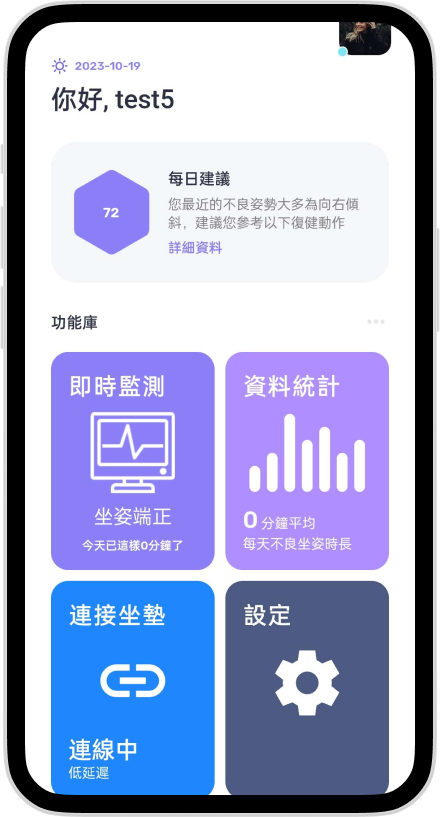
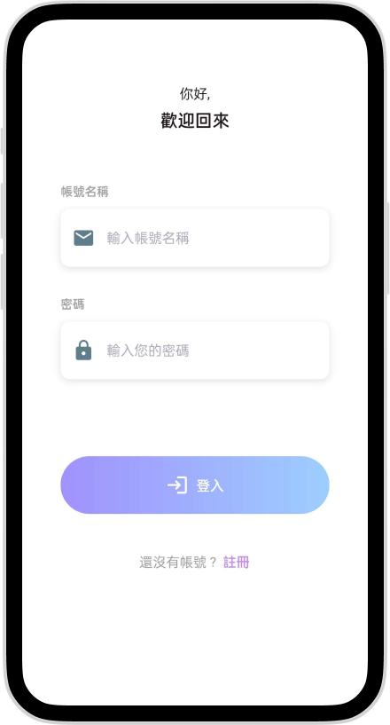
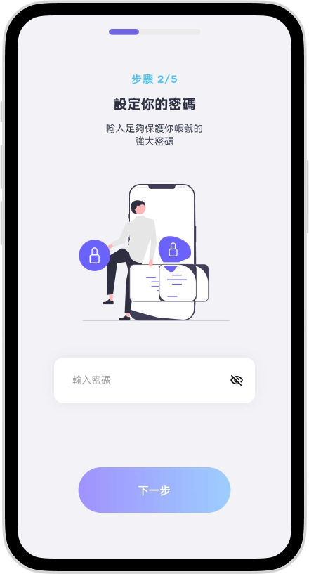
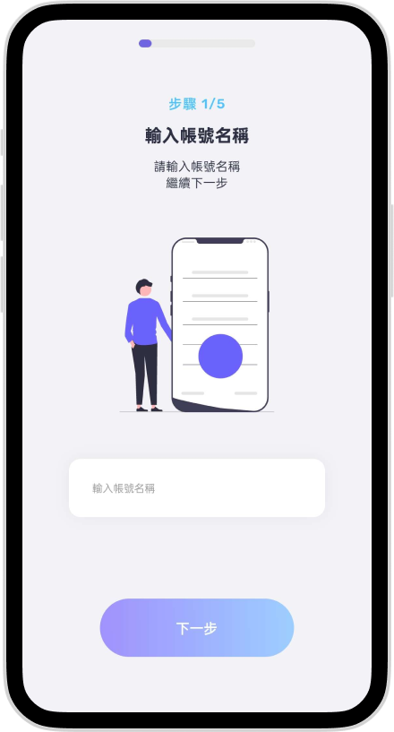
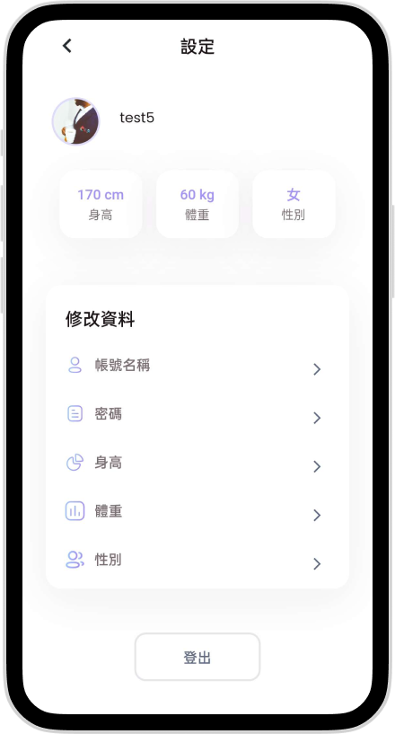
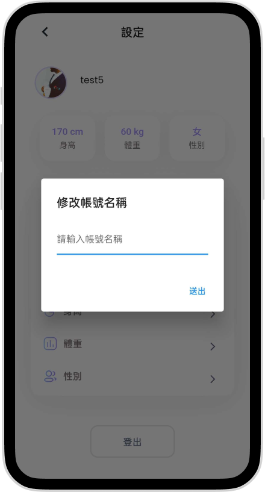
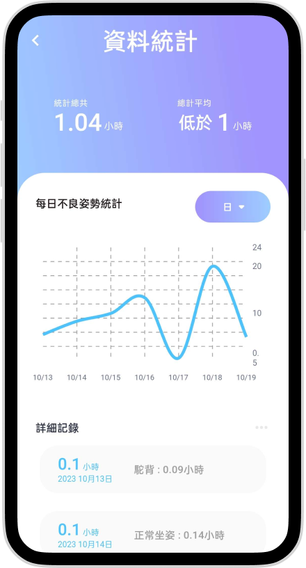

# Sit Posture Detection APP

本專案為一個使用 Flutter 開發的坐姿偵測行動應用程式，主要用於搭配智慧坐墊或感測裝置，記錄使用者坐姿狀態，並透過 App 顯示坐姿分析結果、歷史紀錄與個人化設定。

---

## 專案簡介

Sit Posture Detection APP 是一套坐姿偵測與健康管理應用程式。使用者可透過 App 建立個人資料、登入帳號、連接坐墊裝置，並查看坐姿偵測結果與歷史分析資料。

本專案重點在於實作 Flutter 行動 App 開發、使用者狀態管理、API 串接、感測裝置連線流程，以及坐姿紀錄資料視覺化。

---

## 技術棧

- Flutter
- Dart
- FlutterFlow
- Provider
- GoRouter
- Shared Preferences
- Sqflite
- WebSocket Channel
- WiFi IoT
- Connectivity Plus
- Flutter Local Notifications
- HTTP API
- Railway Backend API

---

## 核心功能

### 使用者流程

- 使用者登入
- 使用者註冊
- 建立個人基本資料
- 輸入身高
- 輸入體重
- 選擇性別
- 編輯個人資料
- 儲存使用者 token
- 維持登入狀態

### 坐姿偵測功能

- 連接智慧坐墊或感測裝置
- 取得坐姿偵測資料
- 顯示目前坐姿狀態
- 紀錄坐姿時間
- 顯示坐姿異常或不良姿勢資料

### 分析與紀錄

- 查詢坐姿紀錄
- 依時間區間取得坐姿資料
- 顯示坐姿分析結果
- 統計不同坐姿狀態的持續時間
- 透過圖表呈現健康數據

### App 功能

- 首頁
- 坐姿偵測頁
- 坐墊連線頁
- 坐姿分析頁
- 設定頁
- 個人資料頁
- 通知功能

---

## 系統架構

本專案採用 Flutter 前端 App 搭配後端 API 的架構。

```text
Flutter App
   |
   |-- UserProfileManager
   |     |-- Login API
   |     |-- Register API
   |     |-- Get User Profile API
   |     |-- Update User Profile API
   |
   |-- AnalyzationManager
   |     |-- Get Sit Record API
   |
   |-- Provider
   |     |-- UserProfileProvider
   |     |-- App State Management
   |
   |-- UI Pages
         |-- Onboarding
         |-- Login
         |-- Home
         |-- Detection
         |-- Analysis
         |-- Settings
```

---

## 專案結構

```text
Sit_Posture_Detection_APP
├── android
├── assets
│   ├── fonts
│   ├── images
│   ├── videos
│   ├── audios
│   ├── lottie_animations
│   ├── rive_animations
│   └── pdfs
├── ios
├── lib
│   ├── flutter_flow
│   ├── generated
│   ├── l10n
│   ├── manager
│   │   ├── analyzationManager.dart
│   │   └── userProfileManager.dart
│   ├── model
│   │   ├── sitRecordModel.dart
│   │   └── userModel.dart
│   ├── pages
│   │   ├── extra_template
│   │   ├── main_pages
│   │   │   ├── analyzation
│   │   │   ├── connect_cushion
│   │   │   ├── detection
│   │   │   ├── home_page
│   │   │   └── settings
│   │   └── starting_pages
│   │       ├── enter_password
│   │       ├── gender_selection
│   │       ├── get_started
│   │       ├── height_entry
│   │       ├── login_page
│   │       ├── mobile_sign_in
│   │       ├── profile_picture
│   │       ├── verify_mobile
│   │       ├── weight_entry
│   │       └── welcome_page
│   ├── app_state.dart
│   ├── index.dart
│   ├── main.dart
│   └── userProfileProvider.dart
├── test
├── web
├── pubspec.yaml
└── README.md
```

---

## 主要模組說明

### `UserProfileManager`

負責處理使用者相關 API：

- 使用者登入
- 使用者註冊
- 取得使用者資料
- 更新身高、體重、性別
- 更新帳號與密碼資料
- 透過 token 維持 API 驗證狀態

### `AnalyzationManager`

負責處理坐姿紀錄查詢：

- 呼叫後端 API 取得坐姿資料
- 支援依照時間區間查詢紀錄
- 回傳坐姿分析資料給前端頁面使用

### `SitRecord`

坐姿紀錄資料模型，主要欄位包含：

- `id`：紀錄編號
- `position`：坐姿狀態
- `time`：紀錄時間
- `second`：持續秒數

### `UserProfileProvider`

負責管理 App 內的使用者狀態，提供頁面讀取使用者 token、身高、體重、性別等資料。

---

## API 串接

目前 App 會串接後端 API：

```text
https://spineinspectorbackend-production.up.railway.app/api
```

主要 API 類型：

```text
POST /user/auth/
POST /user/create/
GET  /user/get/
POST /user/updateprofile/
POST /user/updateuser/
GET  /data/get/
```

---

## 環境需求

- Flutter SDK >= 3.0.0
- Dart >= 3.0.0
- Android Studio 或 VS Code
- Android Emulator 或實體 Android 裝置
- iOS 模擬器或實體 iPhone（需 macOS）

---

## 專案啟動方式

### 1. Clone 專案

```bash
git clone https://github.com/pengleo5422/Sit_Posture_Detection_APP.git
cd Sit_Posture_Detection_APP
```

### 2. 安裝套件

```bash
flutter pub get
```

### 3. 檢查 Flutter 環境

```bash
flutter doctor
```

### 4. 執行 App

```bash
flutter run
```

---

## 常用指令

### 執行測試

```bash
flutter test
```

### 建立 Android APK

```bash
flutter build apk
```

### 建立 Android App Bundle

```bash
flutter build appbundle
```

### 建立 iOS App

```bash
flutter build ios
```

---

## 核心實作重點

- 使用 Flutter 建立跨平台行動 App
- 使用 Provider 管理使用者狀態
- 使用 GoRouter 管理頁面路由
- 使用 HTTP request 串接後端 API
- 使用 token 作為 API 驗證依據
- 使用 model class 解析後端 JSON 資料
- 使用坐姿紀錄模型整理 position、time、second 等資料
- 使用圖表與百分比元件呈現健康分析資訊
- 使用 WiFi / WebSocket 相關套件支援裝置連線場景
- 使用 Shared Preferences 儲存本機狀態資料
- 使用 Flutter Local Notifications 支援通知功能

---

## 專案畫面

### 首頁

<p align="center">
  
</p>

### 登入與註冊

<p align="center">
  
  
  
</p>

### 設定頁面

<p align="center">
  
  
</p>

### 坐姿紀錄與分析

<p align="center">
  
</p>

## 作者

GitHub: https://github.com/pengleo5422
